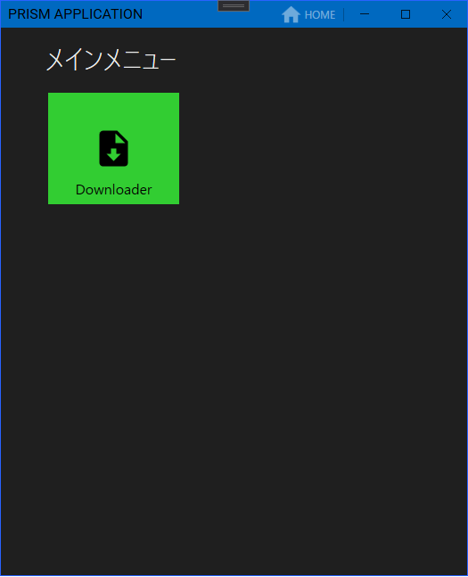
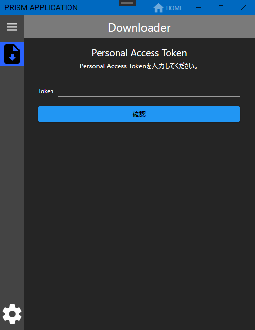
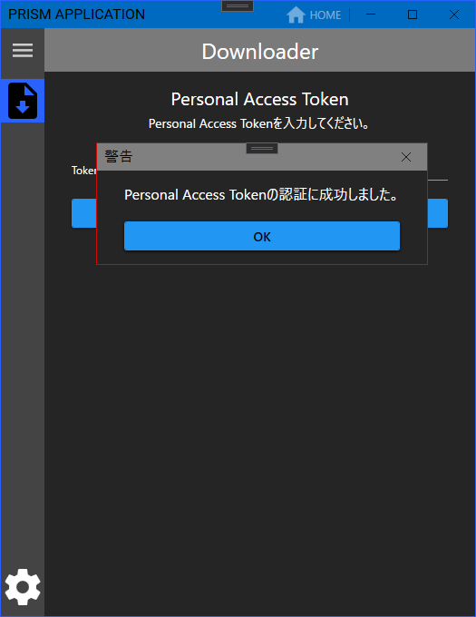
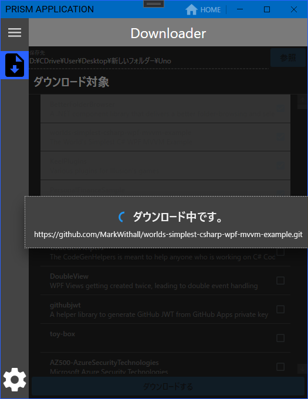

# GithubInfo
GIthubのGitをクローンするやつ

#### ```.conf/```に```AppSettings.conf```を作成し、```{"ModulesDirectory":"","ModulesNames":["GKsWpfPrismLib.Module.Base.dll","GithubInfo.Modules.StarredGithubDownloader.dll"]}```を記載すること

というか記載しないと```GithubInfo.Modules.StarredGithubDownloader```モジュールがロードされません(´･ω･`)







